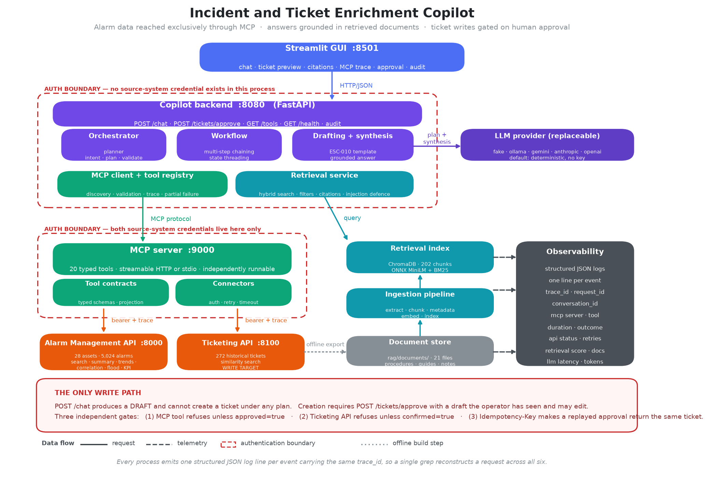

# Incident and Ticket Enrichment Copilot

[](https://github.com/01ayushsharma/Incident-and-ticket-enrichment/actions/workflows/ci.yml)

**Selected use case: Incident and Ticket Enrichment Copilot** — the assigned
use case, implemented end to end ([brief](docs/assignment/Assignment_Use_Case.md)).

An operator describes an alarm situation in plain language. The copilot
resolves the asset, finds and ranks the alarms that matter, correlates them
across equipment, retrieves the governing procedure from a document corpus,
finds how comparable incidents were resolved, and hands back a drafted
ticket with every claim attributed. It reaches alarm and ticket data **only
through a candidate-built MCP server**, grounds its answers in **retrieved
documents with checkable citations**, and **will not create a ticket without
human approval**.

> Senior Software Engineer – Copilot Integration assignment.
> The brief is in [docs/assignment/](docs/assignment/).



---

## Quick start

```bash
git clone https://github.com/01ayushsharma/Incident-and-ticket-enrichment.git
cd Incident-and-ticket-enrichment
docker compose up --build
```

Then open **<http://localhost:8501>**.

**No API key is needed.** The default LLM provider is deterministic, so tool
orchestration, retrieval, citations and the ticket draft are all live out of
the box. See [Using a real model](#using-a-real-model) to swap one in.

<details>
<summary>Running without Docker</summary>

```bash
make install          # venv + dependencies
make ingest           # build the retrieval index (~16s)

# four terminals
make run-alarm-api      # :8000  Alarm Management API simulator
make run-ticketing-api  # :8100  mock ticketing system
make run-mcp            # :9000  MCP server
make run-backend        # :8080  copilot backend
make run-gui            # :8501  Streamlit GUI
```
</details>

| Service | Port | Purpose |
|---|---|---|
| GUI | 8501 | Chat, evidence panel (sources, MCP trace, tickets, audit), ticket approval, feedback |
| Copilot backend | 8080 | Orchestration, MCP client, retrieval |
| MCP server | 9000 | 20 tools over the two source systems |
| Alarm Management API | 8000 | 28 assets, 5,024 alarms |
| Ticketing API | 8100 | 272 historical tickets, the write target |

---

## Try these

| Ask | What happens |
|---|---|
| *Prepare an incident for the highest-priority active alarm in EastRefinery* | Ranks open alarms, scores them, enriches, correlates, finds precedent, retrieves the procedure, drafts a P1 ticket for approval |
| *Investigate recurring high-severity alarms for Boiler Feed Pump 101 over the last 90 days…* | The mandatory acceptance scenario: asset resolution, alarm chaining, RAG, combined reasoning with citations |
| *Show open tickets linked to correlated assets for Crude Charge Motor 501* | Correlation widens the search to co-alarming assets, then finds their open tickets |
| *What is the mandatory response to a boiler drum level low alarm?* | Pure retrieval; cites SAF-020 §3 |
| *What is our policy on expense claims?* | **Says it doesn't know** rather than inventing an answer |

### What one of them actually returns

The acceptance scenario, run against the default deterministic provider -
so this is reproducible on a clean checkout with no API key:

```
POST /chat
{"message": "Investigate recurring high-severity alarms for Boiler Feed Pump 101
             over the last 90 days, retrieve the relevant operating procedure
             and recommend actions"}
```

**MCP execution trace** — eight tools, chained, one trace id throughout:

| # | Tool | Status | ms | System |
|---:|---|---|---:|---|
| 1 | `search_assets` | ok | 380.4 | alarm-api |
| 2 | `list_alarms` | ok | 86.6 | alarm-api |
| 3 | `summarize_alarms` | ok | 24.8 | alarm-api |
| 4 | `list_alarms` | ok | 15.5 | alarm-api |
| 5 | `get_alarm_trends` | ok | 25.2 | alarm-api |
| 6 | `correlate_alarms` | ok | 35.2 | alarm-api |
| 7 | `recommend_operator_actions` | ok | 41.0 | alarm-api |
| 8 | `find_similar_tickets` | ok | 220.3 | ticketing-api |

Step 1 resolves *"Boiler Feed Pump 101"* to `AST-0001`; every later step is
fed by an id an earlier one produced.

**Answer** (abridged — the deterministic provider writes a structured
summary; a real model writes prose over the same evidence):

> **High Vibration** on **Boiler Feed Pump 101**.
>
> **Assessment.** The evidence assembled from the alarm system and the
> document corpus is set out below; every claim is attributable to a cited
> source.
>
> **Documented guidance.** The applicable procedures are [1], [2], [3], [4], [5].
>
> **Comparable cases.** Previous incidents on similar equipment: INC-1006,
> INC-1048, INC-1055.

**Citations** — each excerpt is verified by a test to appear verbatim in the
file it names:

```json
[
  {
    "marker": "[1]", "doc_id": "OP-114", "score": 0.858,
    "title": "Boiler Feedwater Pump Operating Procedure",
    "heading": "4. Abnormal condition response > 4.3 High vibration",
    "source_path": "OP-114-boiler-feedwater-pump-operating-procedure.md",
    "excerpt": "1. Take a spectrum reading and compare with the last route measurement. 2. Trend bearing temperature alongside vibration. A joint rise indicates bearing degradation rather than a process excitation. ... If overall vibration exceeds 9 mm/s, plan a transfer to standby within the shift."
  },
  {
    "marker": "[3]", "doc_id": "KB-PUMP", "score": 0.818,
    "title": "Historical Resolution Notes - Pump",
    "heading": "High Vibration - Shaft misalignment",
    "source_path": "KB-resolution-notes-pump.md",
    "excerpt": "..."
  }
]
```

**Response envelope**: `intent=investigate_asset`, `tools_discovered=20`,
`low_confidence=false`, `degraded=[]`, `trace_id=trace-7f3c1e9a4b26`,
`created_ticket=null` — `/chat` cannot create a ticket under any plan.

---

## What it does

**Natural language in.** Intent detection and planning, constrained by a
JSON schema, validated against the tools that actually exist. A hallucinated
tool name is dropped with a warning, not attempted.

**MCP tool discovery and multi-step chaining.** The copilot discovers 20
tools at runtime. Output of one feeds the next: the ranking tool picks an
alarm, its `alarm_id` drives enrichment and recommendations, its `asset_id`
drives correlation, and the correlated assets drive the ticket search.

**Document RAG in the same workflow.** Retrieval runs *after* the tool
chain, so the query carries what the tools found — the alarm name, the
asset, the likely causes — and the metadata filters come from the same
place. That ordering is what makes this one workflow rather than two
demonstrations.

**Evidence, not assertion.** Every answer carries the MCP execution trace,
document citations with checkable excerpts, and similar historical tickets
with their root causes.

**A gated write.** `POST /chat` produces a draft and cannot create a ticket
under any plan. Creation needs a second request carrying a draft the
operator has seen and may edit, and passes three independent gates.

**Graceful degradation.** A failed tool, an unreachable model, an empty
retrieval — each becomes a visible degradation notice, and the run
continues.

---

## Technology

| Concern | Choice | Why |
|---|---|---|
| Language | Python 3.11 | One language, one test runner, one image |
| APIs | FastAPI + Pydantic v2 | Typed contracts that generate the OpenAPI document |
| MCP | Official `mcp` SDK 2.x | `MCPServer`, streamable HTTP and stdio |
| Embeddings | `all-MiniLM-L6-v2` (ONNX) | Same model as sentence-transformers, ~79 MB instead of ~2.5 GB |
| Vector store | ChromaDB | Persistent, no server to run |
| Lexical search | BM25 (`rank-bm25`) | Catches rare tokens embeddings miss |
| LLM | Pluggable | `fake` (default) · `ollama` · `gemini` · `anthropic` · `openai` (also serves Groq) |
| GUI | Streamlit | Fast to build, and the evidence panels matter more than the chrome |
| Logging | structlog | One JSON line per event, secrets redacted |

---

## MCP server

20 tools, 18 read-only and 2 marked as writes. Runs independently of the
copilot:

```bash
python -m alarm_mcp                     # streamable HTTP on :9000/mcp
MCP_TRANSPORT=stdio python -m alarm_mcp # stdio, for Claude Desktop or the Inspector
```

**Alarm Management** — `search_assets`, `get_asset_metadata`, `list_alarms`,
`get_alarm_detail`, `rank_active_alarms_by_priority`, `summarize_alarms`,
`get_alarm_trends`, `correlate_alarms`, `analyze_alarm_floods`,
`find_rationalization_candidates`, `score_alarm_priority`,
`recommend_operator_actions`, `compute_kpi`, `list_kpi_definitions`

**Ticketing** — `find_similar_tickets`, `list_tickets`, `get_ticket`,
**`create_ticket`** (write), **`add_ticket_comment`** (write)

**Operations** — `check_source_systems`

Full schemas, error behaviour and executed examples:
**[docs/mcp-tool-catalog.md](docs/mcp-tool-catalog.md)** — generated from a
live `list_tools` call, so it cannot drift from the code.

---

## RAG

21 documents, ~15,500 words → 202 chunks. Nine of them are generated from
the resolved tickets, so a citation carries ticket keys the user can open.

```bash
make ingest                                    # build the index
python -m rag.ingestion.cli --query "…"        # smoke-test retrieval
```

Heading-aware chunking, hybrid dense + BM25 retrieval, metadata filtering,
checkable citations, a measured confidence floor, and layered
prompt-injection defence. Design and measurements:
**[docs/rag-design.md](docs/rag-design.md)**.

---

## Configuration

Copy `.env.example` to `.env`. Every value has a working default.

| Variable | Default | Notes |
|---|---|---|
| `LLM_PROVIDER` | `fake` | `fake` · `ollama` · `gemini` · `anthropic` · `openai` |
| `LLM_API_KEY` | — | Only for a hosted provider |
| `ALARM_API_TOKEN` | `demo-token` | Alarm API bearer token |
| `TICKETING_API_TOKEN` | `demo-ticket-token` | Deliberately different |
| `MCP_TRANSPORT` | `http` | Or `stdio` |
| `RAG_MIN_SCORE` | `0.32` | Confidence floor; measured, see rag-design |
| `RAG_DENSE_WEIGHT` | `0.6` | Dense/lexical fusion weight |
| `ALARM_API_SEED` | `20260501` | Dataset is reproducible from this |

### Using a real model

```bash
# Groq - free, no card, OpenAI-compatible wire format
# key: console.groq.com/keys
LLM_PROVIDER=openai LLM_MODEL=llama-3.3-70b-versatile LLM_BASE_URL=https://api.groq.com/openai/v1 LLM_API_KEY=gsk_... docker compose up

# Google Gemini - free tier, key: aistudio.google.com/apikey
LLM_PROVIDER=gemini LLM_MODEL=gemini-2.0-flash LLM_API_KEY=... docker compose up

# fully offline, no key at all
LLM_PROVIDER=ollama LLM_MODEL=llama3.1:8b LLM_BASE_URL=http://localhost:11434 ...
```

The `openai` provider speaks the OpenAI chat-completions format, so it also
serves Groq, Together, Fireworks and any other OpenAI-compatible endpoint —
point `LLM_BASE_URL` at them.

Only the narrative changes. Orchestration, retrieval, citations and the
draft are identical.

---

## Tests

```bash
make test           # everything
make test-unit      # fast, no I/O
make test-integration
make test-e2e
make coverage
```

**325 tests, all passing.** No API key required for any of them.

| Suite | Count | Covers |
|---|---:|---|
| Simulator contract | 74 | Auth, trace, pagination, sorting, error envelope, determinism, analytics |
| Ticketing | 31 | Similarity, the write gates, idempotency |
| LLM adapters | 26 | Request shape, auth header, structured output, error mapping, retries |
| Postman chaining | 11 | The CHAIN flows replayed with their assertions |
| MCP contracts | 31 | Discovery, schemas, chaining, error mapping, auth, health |
| MCP transport | 10 | Streamable HTTP over real sockets, trace propagation into the source systems |
| Resilience | 11 | Retry limits, backoff, timeouts, which writes may be replayed |
| Orchestration | 45 | Intent, chaining, partial failure, LLM degradation, priority matrix |
| RAG | 73 | Relevance, citations, filters, low confidence, injection |
| End-to-end | 13 | The acceptance scenario and the full incident-to-ticket journey |

These counts are generated, not maintained by hand — see
[docs/coverage-summary.md](docs/coverage-summary.md), which
`scripts/generate_coverage_summary.py` writes from the coverage data.

The tests assert on *meaning*, not on status codes. They caught, among
others: BM25 max-normalisation making the low-confidence gate unreachable;
`doc_type` filtering leaking lexical hits; the mandatory acceptance scenario
making zero MCP calls because of first-match-wins intent rules; and an
unreachable MCP server surfacing as a `CancelledError` that would have
crashed the backend at startup instead of degrading.

---

## Architecture

```
GUI → copilot backend → MCP client ═══ MCP ═══> MCP server → source systems
                      ↘ retrieval → Chroma + BM25 ← ingestion ← documents
```

The copilot holds **no HTTP client for any source system** and **no
source-system credential**. Both tokens live in the MCP server alone.

- [docs/architecture.md](docs/architecture.md) — layers, request flow, boundaries
- [docs/design-decisions.md](docs/design-decisions.md) — 14 decisions and their costs
- [docs/api-integration.md](docs/api-integration.md) — the API contract, retries, auth
- [docs/known-limitations.md](docs/known-limitations.md) — read this one
- [docs/coverage-summary.md](docs/coverage-summary.md) — where the tests are, and are not

### Repository layout

```
apps/backend/copilot/     orchestration, MCP client, LLM providers, API
apps/frontend/gui/        Streamlit interface
mcp-servers/alarm-management/   the MCP server: 20 tools
connectors/               shared auth, retry, tracing, error envelope
services/alarm_api/       Alarm Management API simulator
services/ticketing_api/   mock ticketing system
rag/                      ingestion, retrieval, documents, tests
tests/                    unit · integration · e2e
docs/                     architecture, tool catalog, RAG design, decisions
scripts/                  seed and documentation generators
postman/                  the API specification this was built against
```

---

## The write path

This is the part worth checking carefully.

1. `POST /chat` produces a **`TicketDraft`**. No plan can reach
   `create_ticket`; a test asserts the tool never appears in a chat trace.
2. The GUI renders the draft with every field editable.
3. `POST /tickets/approve` carries the draft id and the operator's edits.
4. Three independent gates: the MCP tool refuses unless `approved=true`; the
   ticketing API refuses unless `confirmed=true`; an `Idempotency-Key`
   derived from the conversation and alarm makes a replayed approval return
   the original ticket rather than opening a second one.
5. Every step is recorded in the audit trail with actor, action and trace id.

---

## Assumptions

- The Postman collections are the authoritative API specification; where
  they were ambiguous I chose the reading that made the chaining flows work.
- The alarm dataset is fixed in time (2026-04-01 to 2026-09-30) for
  reproducibility, so relative windows resolve against that horizon rather
  than the wall clock.
- A candidate-built mock is the right ticketing choice: it needs no external
  credentials, so an evaluator can run the whole stack cold.
- An evaluator has no LLM API key, so the system must be fully functional
  without one.

## Known limitations

Summarised honestly in
**[docs/known-limitations.md](docs/known-limitations.md)**. The headline:
**Docker was not installed on the build machine**, so `docker compose up`
has not been run by the author — though the same topology has been verified
over real sockets, and CI exercises the compose stack.

## Demo

**Video:** *(link once uploaded — see [docs/demo.md](docs/demo.md) for the shot list)*

[docs/demo.md](docs/demo.md) is a timed walkthrough covering tool discovery,
the full incident-to-ticket journey, the approval gate and its idempotency,
the acceptance scenario, two degraded scenarios, and trace propagation
across all six processes. Screenshots go in
[docs/screenshots/](docs/screenshots/).

**Coverage:** [docs/coverage-summary.md](docs/coverage-summary.md) — 88%
branch coverage over 5,281 statements
overall, with the gaps named rather than averaged away.

## Licence

MIT — see [LICENSE](LICENSE).
